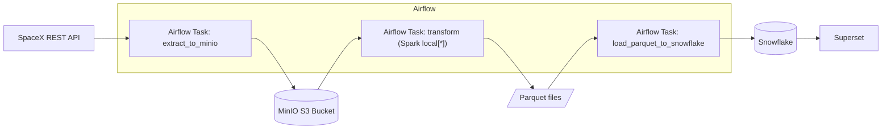

# SpaceX ETL (Airflow + Spark + MinIO + Snowflake + Superset)

End-to-end ETL that downloads SpaceX launches, stores raw JSON in MinIO, transforms it to Parquet with Spark, and loads into Snowflake. Superset can connect to Snowflake for dashboards.

## Architecture

## Quick start
1) Copy env template and configure:
- `cp .env.example .env`
- Fill Snowflake variables (account, user, password, warehouse, database, schema)

2) Start the stack:
- `docker compose up -d`

3) Run the pipeline:
- Open Airflow: http://localhost:8081
- Enable DAG `spacex_etl_dag` and trigger a run

Optional UIs:
- Spark Master: http://localhost:8080
- MinIO Console: http://localhost:9001 (minioadmin / minioadmin)
- Superset: http://localhost:88 (admin / admin)

## Configuration
Environment variables (via `.env`):
- MinIO
  - `MINIO_ENDPOINT_URL` (default: http://minio:9000)
  - `MINIO_ACCESS_KEY` (default: minioadmin)
  - `MINIO_SECRET_KEY` (default: minioadmin)
  - `MINIO_BUCKET_NAME` (default: spacex-data)
- Snowflake
  - `SNOWFLAKE_ACCOUNT`
  - `SNOWFLAKE_USER`
  - `SNOWFLAKE_PASSWORD`
  - `SNOWFLAKE_WAREHOUSE` (default: COMPUTE_WH)
  - `SNOWFLAKE_DATABASE`
  - `SNOWFLAKE_SCHEMA` (default: PUBLIC)
  - `SNOWFLAKE_ROLE` (optional)
- Parquet output path (inside Airflow containers)
  - `PARQUET_PATH` (default: /opt/airflow/etl/data/parquet)

Centralized constants:
- `etl/config/config.py` exposes `BUCKET_NAME`, `PARQUET_PATH`, `SNOWFLAKE_SCHEMA`

## Validate
- Check Parquet locally (host):
  - `python scripts/check_parquet_data.py`
- Check Snowflake table:
  - `python scripts/check_snowflake_data.py`

SQL bootstrap for Snowflake (optional):
- See `snowflake_setup.sql` for creating warehouse, DB, schema, table, and sample views.

## Project layout
- DAGs: `dags/`
- ETL package: `etl/`
  - Extract: `etl/extract/`
  - Transform: `etl/transform/`
  - Load: `etl/load/`
  - Utils: `etl/utils/`
  - Config: `etl/config/`
- Helper scripts: `scripts/`
- Docker/Compose: repo root

Notes:
- Logging is used across all components (no prints) for clean Airflow logs.
- Credentials are loaded from environment; secrets are not committed.
